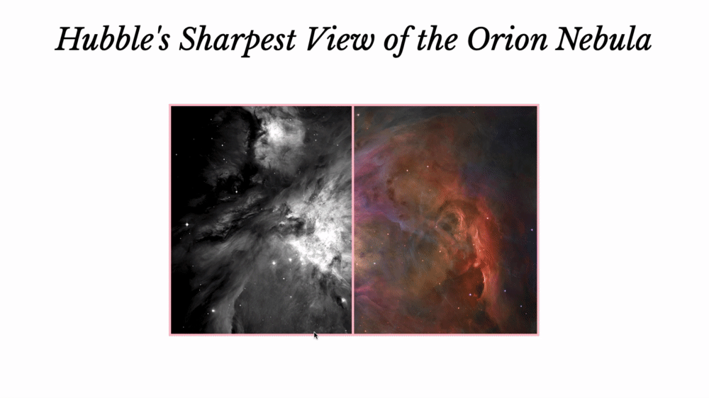

# Resizeable Panes

"Resizeable Panes" was a small jQuery project done at my stint at [SPICED Academy](https://www.spiced.academy/program/full-stack-web-development/). The image displays Hubble's sharpest view of the Orion Nebula.

---

## Siteflow

## Demo

https://videothrone.github.io/resizeable-panes/

## Tech

HTML, CSS, jQuery

## Features

-   Users can drag the bar on mousedown to reveal more of a color version of a bw photo of the Orion Nebula.

-   The moment the user releases the mouse, the bar jumps back to the initial middle position.

## Goals while doing the project

-   This was a little exercise, learning a basic UI feature with `mousedown`and jQuery along the way.

## Image Credit

Hubble's Sharpest View of the Orion Nebula
https://www.flickr.com/photos/nasacommons/16239715270/
